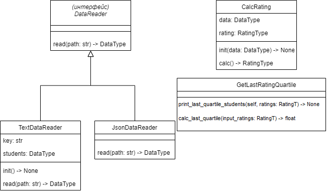

# Лабораторная 1 по дисциплине "Технологии программирования"

Это репозиторий для лабораторной №1 по технологиям программирования в ВолгГТУ.

Вариант: 2. Тип данных: JSON, расчётная процедура: вычислить и вывести на экран всех студентов, чей рейтинг попадает в последнюю квартиль распределения по рейтингам.

Используемые технологии: Python

UML-диаграмма классов:
